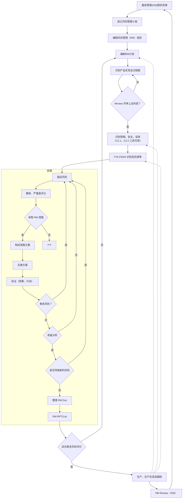

# ISO14971:2019 决策树

```mermaid
---
ISO14971:2019 决策树
---
flowchart TD
    id1["最高管理(GM)提供资源"]-->id2[成立风险管理小组]
    id2-->id3["编制风险管理（RM）准则"]
    id3-->id4["编制RM计划"]
    id4-->id5["识别产品实现全过程图"]
    id5-->id6{"Review 评审上述内容？"}
    id6-->|否|id5
    id6-->|是|id7["识别预期，安全，误用（C2.1，C2.2 工具可用）"]
    id7-->id8["FTA,FEMA 识别危险源等"]
    id8-->id9["描述风险"]
    subgraph 处理
        id9-->id10["概率、严重度评分"]
        id10-->id11{"采取 RM 措施"}
        id11-->|是|id12["制定措施方案"]
        id11-->|否|???
        id12-->id13["实施方案"]
        id13-->id14["验证（效果，行动）"]
        id14-->id15{"剩余风险？"}
        id15-->|否|id16{"收益分析"}
        id15-->|是|id9
        id16-->|是|id17{"是否导致新的风险"}
        id16-->|否|id9
        id17-->|否|id18["整理 RM Doc"]
        id17-->|是|id9
        id18-->id19["RM RPT/List"]
    end
    id19-->id20{"综合剩余风险评价"}
    id20-->|是|id21["生产，生产后信息跟踪"]
    id20-->|否|id4
    id21-->id22["RM Review（GM）"]
    id21-.->id4
    id21-.->id7
    id21-.->id8
    id22-->id1
```