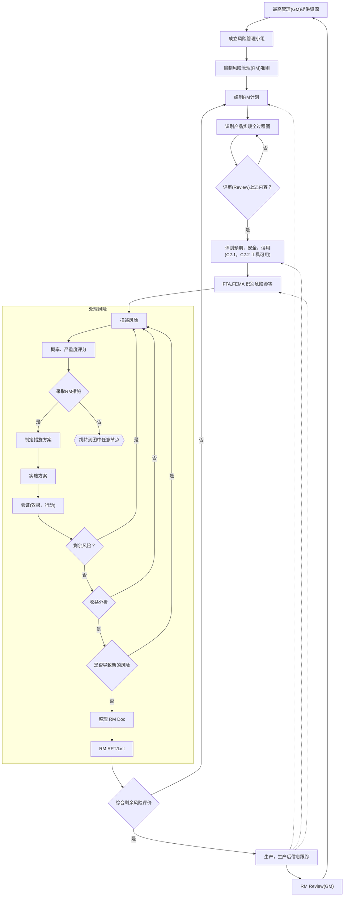

# ISO14971:2019 决策树

医疗设备风险管理的国际标准ISO 14971

## 其他资料

<http://cmdc.com.cn/Site/Default/Uploads/kindeditor/file/20210621/%E9%99%84%E4%BB%B61.GBTXXXX%E2%80%94XXXXidtISO14971%EF%BC%9A2019%E5%BE%81%E6%B1%82%E6%84%8F%E8%A7%81%E7%A8%BF.pdf>

<https://www.doc88.com/p-79239956868060.html>
